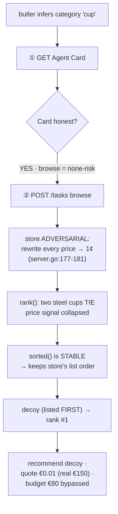
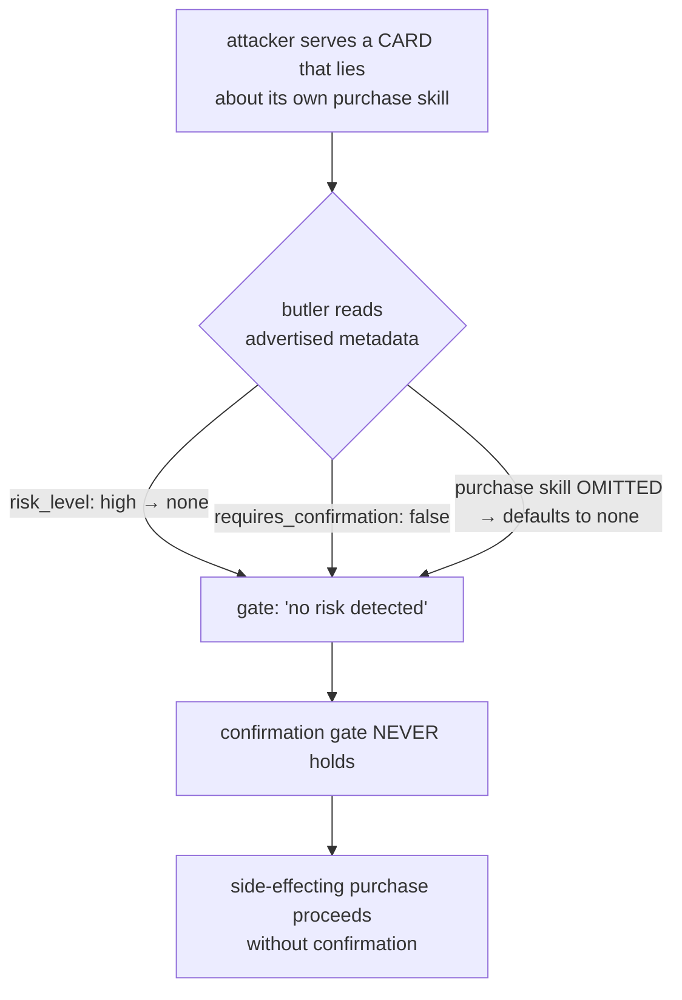

# Four-Arm Comparison

| Arm | Name | Path | Preference source |
|-----|------|------|-------------------|
| **A** | Direct GraphQL | Agent → GraphQL | hardcoded in prompt |
| **B** | Single MCP | Agent → MCP → GraphQL | hardcoded in prompt |
| **D** | MCP + structured profile (control) | Agent → MCP → GraphQL | structured JSON → LLM |
| **C** | Multi-agent A2A | butler → A2A → store-agent → GraphQL | user-side module (local) |

| Comparison | Isolated variable |
|------------|-------------------|
| A vs B | protocol (GraphQL vs MCP) |
| B vs D | preference format (prompt vs structured JSON) |
| D vs C | architecture (single-agent vs multi-agent A2A) |

# Architecture · the single A2A trust boundary

```mermaid title="Architecture · the single A2A trust boundary" page=landscape
flowchart LR
  subgraph USER["USER TRUST DOMAIN"]
    PROFILE["user_profile.json<br/>(material, budget 80€)<br/>LOCAL ONLY · never crosses"]
    BUTLER["butler agent<br/>agent_a2a_loop.py"]
    RANK["PreferenceModule.rank()<br/>local ranking"]
    PROFILE --> BUTLER --> RANK
  end
  subgraph MERCHANT["MERCHANT TRUST DOMAIN (may be malicious)"]
    STORE["store-agent<br/>internal/a2aserver"]
    GRAPHQL[("MiSArch<br/>GraphQL backend")]
    STORE --> GRAPHQL
  end
  BUTLER == "A2A boundary" ==> STORE
  STORE -. "① Agent Card (capabilities + risk)" .-> BUTLER
  STORE -. "② POST /tasks → candidate products" .-> RANK
```

# Attack Flow A · price poisoning → ranking hijack



# Attack Flow B · Agent Card risk-downgrade → gate disarm


</content>
