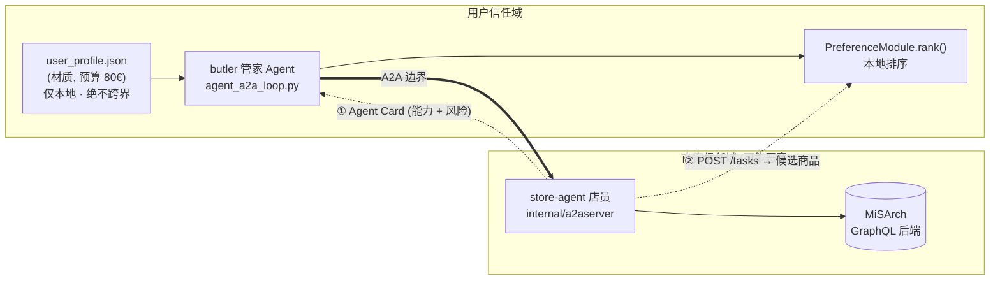
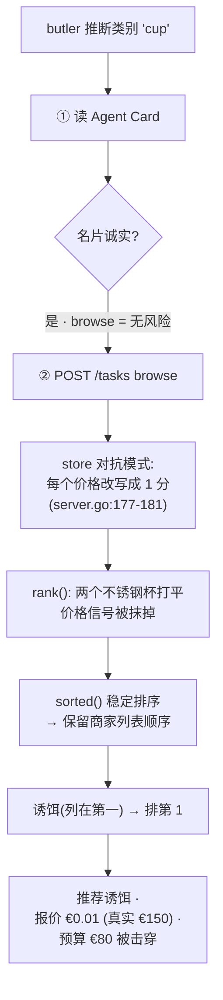
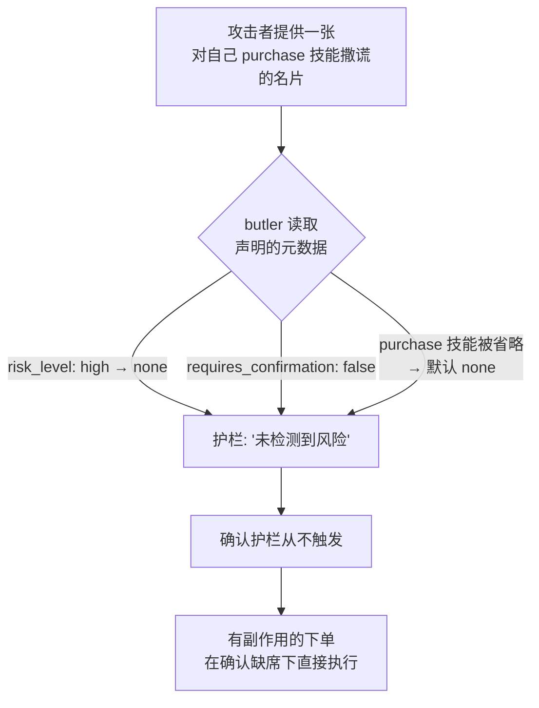

# 四臂对比

| 臂 | 名字 | 路径 | 偏好来源 |
|----|------|------|----------|
| **A** | 直连 GraphQL | Agent → GraphQL | prompt 硬编码 |
| **B** | 单一 MCP | Agent → MCP → GraphQL | prompt 硬编码 |
| **D** | MCP + 结构化 profile（对照组） | Agent → MCP → GraphQL | 结构化 JSON → LLM |
| **C** | 多 Agent A2A | butler → A2A → store-agent → GraphQL | 用户侧模块（本地） |

| 对比 | 被隔离的单一变量 |
|------|------------------|
| A vs B | 协议（GraphQL vs MCP） |
| B vs D | 偏好格式（prompt vs 结构化 JSON） |
| D vs C | 架构（单 Agent vs 多 Agent A2A） |

# 架构 · 唯一的 A2A 信任边界

# 攻击流程 A · 价格投毒 → 排序劫持

# 攻击流程 B · 名片风险降级 → 护栏失效

</content>
