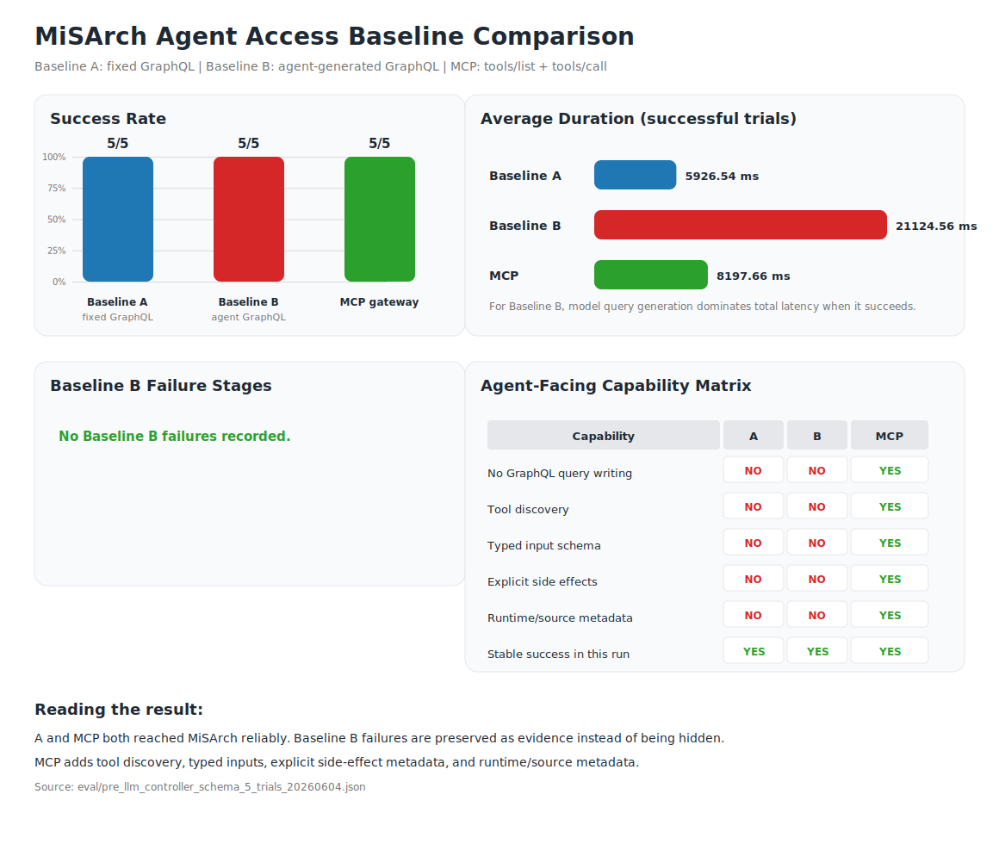
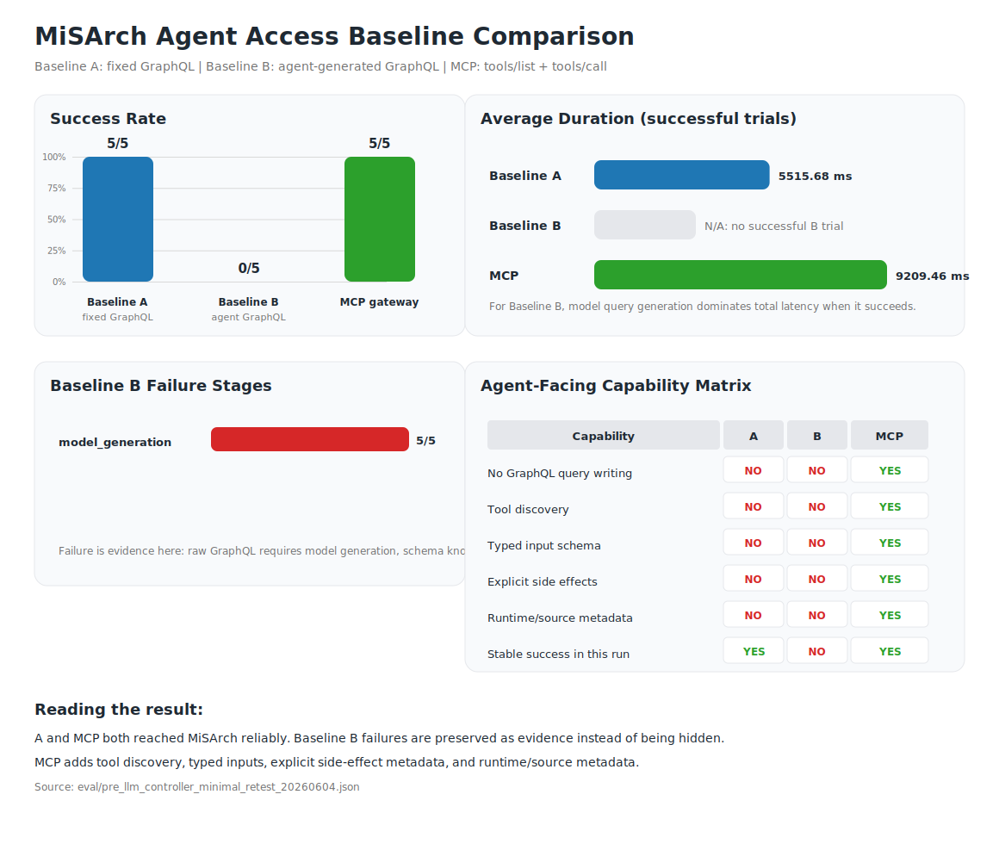
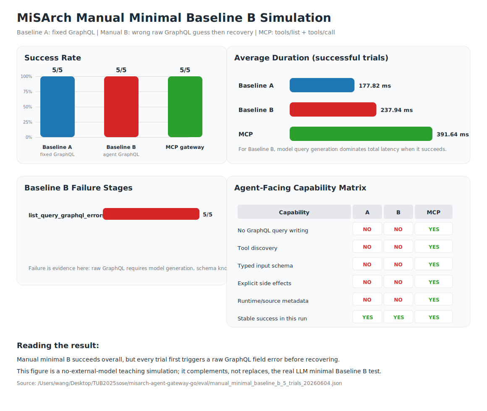

# Pre 测试结果：Baseline A / Baseline B / MCP Gateway

这份文档用于 presentation / pre 展示。当前测试已经改成 LLM controller 设计：

```text
Baseline A: LLM 选择 fixed GraphQL executor，executor 执行预写 GraphQL query
Baseline B: LLM 自己生成 GraphQL query，executor 执行生成的 query
MCP: LLM 基于 tools/list 规划 tools/call，executor 执行 MCP tool calls
```

## 1. 实验环境

| 项目 | 值 |
|---|---|
| MiSArch GraphQL | `http://34.40.117.201:8080/graphql` |
| MCP Gateway | `http://34.40.117.201:8001/mcp` |
| MCP Readiness | `http://34.40.117.201:8001/readyz` |
| 测试脚本 | `scripts/agent_gcp_smoke_test.py` |
| 可视化脚本 | `scripts/visualize_agent_baselines.py` |
| 商品数据规模 | 102 products / 11 categories |
| 测试商品 | `HomeLink Smart Plug Twin Pack` |

测试商品核心字段：

| 字段 | 值 |
|---|---|
| `product_id` | `0418eaa4-4621-427a-824b-0051097bd602` |
| `variant_id` | `934b29e0-4280-4c04-af2d-59d4625f8f3f` |
| `name` | `HomeLink Smart Plug Twin Pack` |
| `price` | `2799 cents = 27.99 EUR` |
| `category` | `Electronics & Gadgets` |

## 2. 实验设计

| 路径 | LLM 是否参与决策 | LLM 做什么 | 执行器做什么 |
|---|---:|---|---|
| Baseline A | 是 | 选择 `fixed_graphql_catalog_lookup` | 执行预写 `LIST_PRODUCTS_QUERY` 和 `GET_PRODUCT_QUERY` |
| Baseline B | 是 | 自己生成 GraphQL list/detail query | 执行 LLM 生成的 GraphQL query |
| MCP | 是 | 根据 `tools/list` 规划 `list_products -> get_product` | 执行 MCP `tools/call` |

我做了三组实验：

| 实验 | Baseline B 文档条件 | 目的 |
|---|---|---|
| Schema experiment | 给 LLM 简短 GraphQL schema excerpt | 测试 agent 在有 schema 文档时能否直接使用 GraphQL |
| Minimal experiment | 不给 GraphQL schema 字段文档 | 测试 agent 直接面对 raw GraphQL 的脆弱性 |
| Manual minimal simulation | 不调用外部模型 API，手工先猜错字段再恢复 | 把 raw GraphQL 的“先失败、再修复”过程显式保存下来 |

## 3. Schema Experiment 结果

结果文件：

- `eval/pre_llm_controller_schema_5_trials_20260604.json`
- `eval/pre_llm_controller_schema_5_trials_20260604.csv`
- `eval/pre_llm_controller_schema_visualization_20260604.svg`



| 指标 | Baseline A | Baseline B | MCP |
|---|---:|---:|---:|
| success | `5/5` | `5/5` | `5/5` |
| same core product data | `5/5` vs MCP | `5/5` vs A | `5/5` vs A |
| avg duration | `5926.54 ms` | `21124.56 ms` | `8197.66 ms` |
| query/tool generation avg | fixed executor | `20934.75 ms` | included in controller time |
| tool discovery | no | no | yes |
| typed input schema | no | no | yes |
| explicit side effects | no | no | yes |
| runtime/source metadata | no | no | yes |

解释：

```text
在有 schema 文档时，Baseline B 可以成功生成 GraphQL query，并且返回的数据和 Baseline A / MCP 一致。
但是 Baseline B 的平均耗时最高，因为绝大多数时间花在 LLM 生成 GraphQL query 上。
MCP 也需要 LLM 做工具规划，但不需要 LLM 写 GraphQL query；它通过 tools/list 和 inputSchema 降低了接口使用难度。
```

## 4. Minimal Experiment 结果

结果文件：

- `eval/pre_llm_controller_minimal_retest_20260604.json`
- `eval/pre_llm_controller_minimal_retest_20260604.csv`
- `eval/pre_llm_controller_minimal_retest_visualization_20260604.svg`



| 指标 | Baseline A | Baseline B | MCP |
|---|---:|---:|---:|
| success | `5/5` | `0/5` | `5/5` |
| same core product data | `5/5` vs MCP | `0/5` comparable | `5/5` vs A |
| avg duration | `5515.68 ms` | N/A | `9209.46 ms` |
| Baseline B failure stage | N/A | `model_generation: 5` | N/A |

Baseline B 每次失败的结构类似：

```json
{
  "path": "agent_generated_graphql",
  "enabled": true,
  "success": false,
  "failure_stage": "model_generation",
  "error": "The read operation timed out",
  "raw_model_output": null,
  "generated_plan": null,
  "raw_list_response": null,
  "raw_detail_response": null,
  "doc_level": "minimal",
  "schema_context_provided": false
}
```

解释：

```text
Minimal experiment 中 Baseline B 没有到达 GraphQL execution 阶段，而是在 model_generation 阶段 timeout。
这说明 agent-generated GraphQL 额外依赖模型生成步骤；如果模型生成不稳定或超时，agent 无法开始访问 GraphQL。
Baseline A 和 MCP 仍然 5/5 成功，因为它们不需要 LLM 自己生成 GraphQL query。
```

需要注意：

```text
这轮 minimal 失败证明的是 model-generation dependency，而不是 GraphQL 字段写错。
脚本已经支持记录 GraphQL query 错误，例如 failure_stage=list_query_graphql_errors。
如果模型成功返回错误 query，结果会保存 GraphQL 原始 errors。
```

## 5. 手工模拟 Minimal Baseline B

这组实验不是“真实 LLM Baseline B”，而是一个教学型、可复现的手工 agent 模拟：

```text
先发一个看起来合理、但其实错误的 raw GraphQL list query
收到 GraphQL error 和字段提示
再改用 context-informed 的正确 query
最后取回和 Baseline A / MCP 一致的商品数据
```

结果文件：

- `eval/manual_minimal_baseline_b_5_trials_20260604.json`
- `eval/manual_minimal_baseline_b_5_trials_20260604.csv`
- `eval/manual_minimal_baseline_b_visualization_20260604.svg`
- `scripts/manual_minimal_baseline_eval.py`



| 指标 | Baseline A | 手工 minimal Baseline B | MCP |
|---|---:|---:|---:|
| success | `5/5` | `5/5` | `5/5` |
| same core product data | `5/5` vs MCP | `5/5` vs A | `5/5` vs A |
| 初始 GraphQL 错误 | N/A | `5/5` | N/A |
| recover after failure | N/A | `5/5` | N/A |
| avg attempts | fixed executor | `3.0` | tools/list + tools/call |
| avg duration | `177.82 ms` | `237.94 ms` | `391.64 ms` |

5 次错误字段猜测分别是：

- `productList`
- `listProducts`
- `catalogProducts`
- `productsList`
- `getProducts`

它们都先返回类似错误：

```text
Cannot query field "productList" on type "Query". Did you mean "products", "product", "productItem", or "productItems"?
```

解释：

```text
这组实验的价值，不在于证明“LLM 一定会这样修复”，而在于把 raw GraphQL 的交互难点拆开给你看。

也就是说，agent 如果没有 MCP tools/list 和 input schema，往往要先猜字段名；猜错以后，才能依赖 GraphQL error message、schema 文档或额外上下文继续修复。

因此，这组手工模拟适合在 pre 时展示“raw GraphQL 为什么对 agent 不够友好”；而真正的 minimal LLM experiment 则负责展示“不给 schema 时，真实 Baseline B 可能根本卡在模型生成阶段”。
```

## 6. Pre 可讲结论

一句话结论：

```text
GraphQL 是强大的 developer-facing API；MCP gateway 把它变成 agent-facing tools，使 agent 能通过工具发现、结构化输入和副作用元数据更稳定地访问 MiSArch。
```

推荐讲法：

```text
我设计了三条路径。Baseline A 让 LLM 选择一个固定 GraphQL executor；Baseline B 让 LLM 自己生成 GraphQL；MCP 让 LLM 先读取 tools/list，再规划 tools/call。

Schema experiment 证明：在有 schema 文档时，三条路径都能返回同一个真实商品，说明数据一致性成立。

Minimal experiment 证明：当不给 GraphQL 字段文档时，Baseline B 暴露出额外的不稳定性，本轮失败在 model_generation timeout。这个失败本身是有效证据，因为 raw GraphQL 路径依赖 LLM 先生成正确 query。

MCP 的优势不是返回了不同数据，而是在保持数据一致的同时，提供 tool discovery、input schema、runtime/source_service 和 side_effects。
```

## 7. 答辩问题准备

Q: 为什么 Baseline A 比 MCP 快？

A:

```text
Baseline A 使用固定 GraphQL executor，路径最短。MCP 需要 initialize、tools/list、tools/call，并且 LLM controller 还要规划工具调用，所以耗时更高。
```

Q: Baseline B 在 schema experiment 成功了，为什么还需要 MCP？

A:

```text
Baseline B 成功依赖 schema 文档和 LLM 正确生成 query，而且耗时最高。MCP 不要求 agent 写 GraphQL，而是通过 tools/list 和 inputSchema 把能力显式暴露出来，更适合 agent 使用。
```

Q: Minimal experiment 的失败是不是只是模型服务问题？

A:

```text
这轮确实失败在 model_generation timeout，所以它证明的是 Baseline B 对模型生成步骤有额外依赖。脚本同时支持记录 GraphQL query 错误；如果模型生成了错误 query，会保存 list_query_graphql_errors 或 detail_query_graphql_errors。
```

Q: MCP 的 side_effects 有什么价值？

A:

```text
agent 需要知道调用工具是否会改变系统状态。list_products 和 get_product 返回 side_effects=none (read-only)，因此 agent 可以安全读取。对于 create_pending_order，描述中明确说明它会创建 shopping cart item 和 pending order，但不会支付。
```
